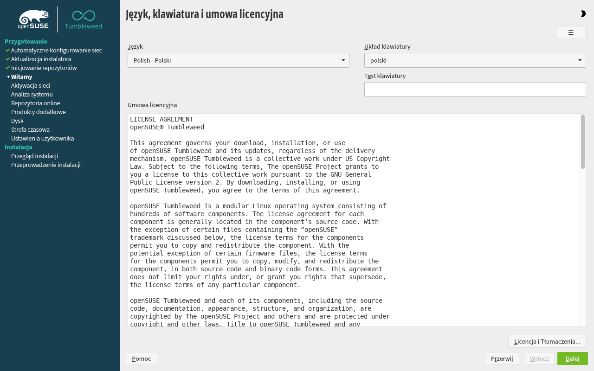
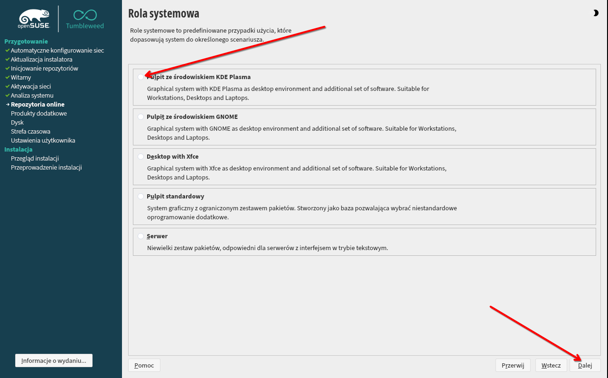
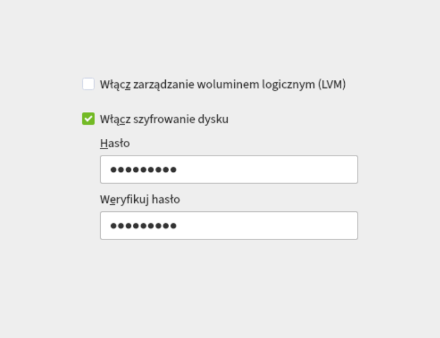
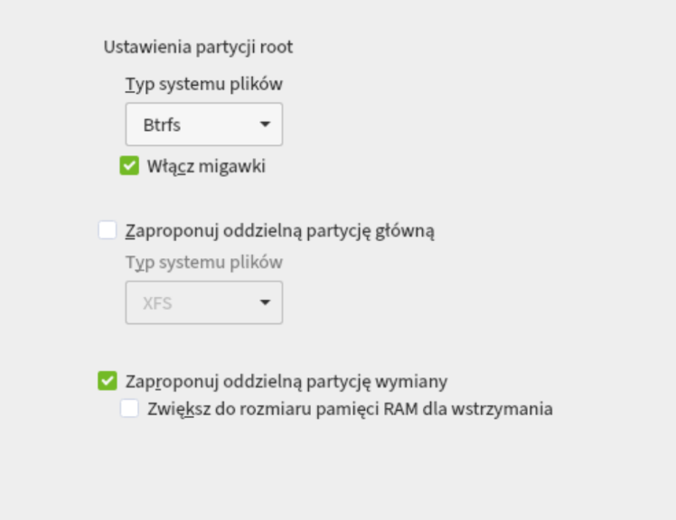
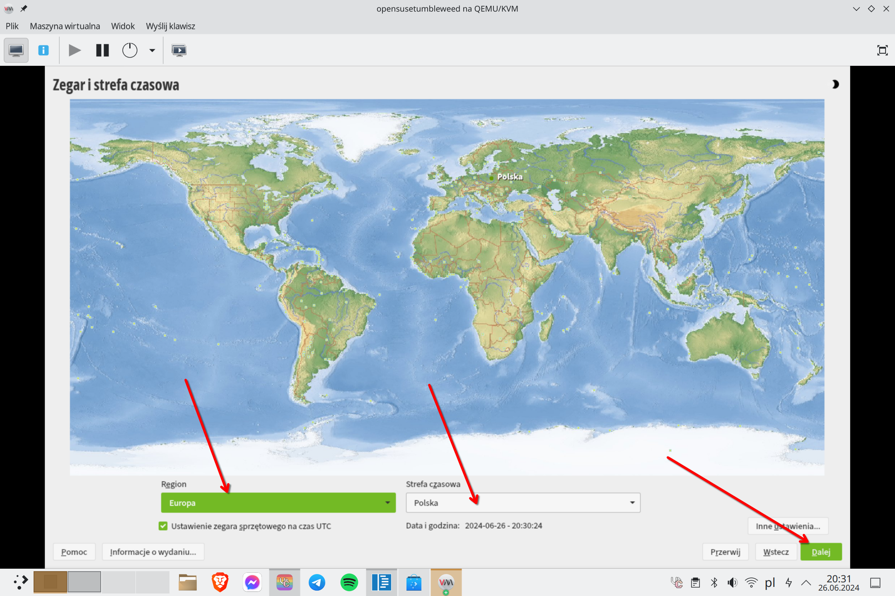
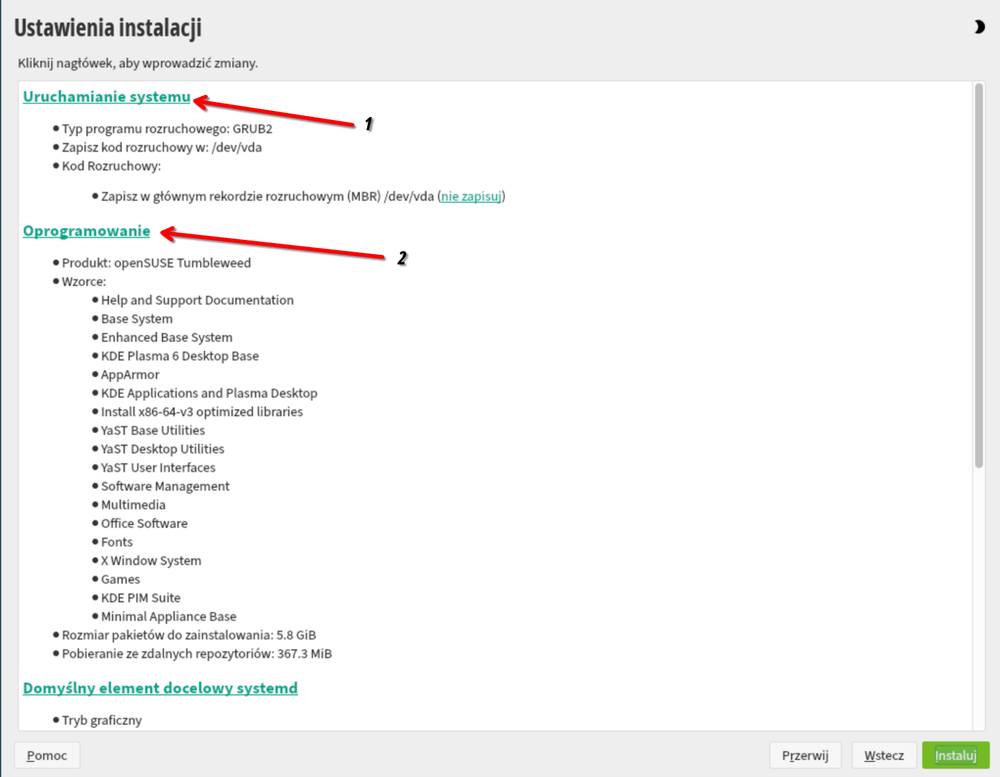
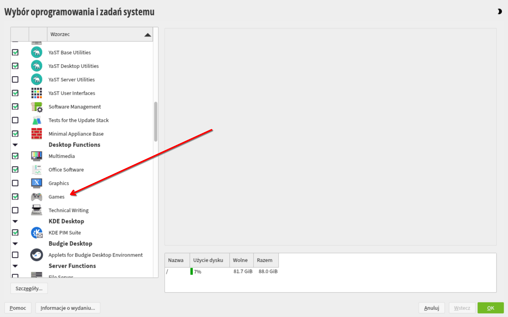

# Instalacja systemu

Przejdziemy razem przez instalację systemu openSUSE tumbleweed. Pobierzemy iso, nagramy je na pendrive i przejdziemy przez instalator systemu (Yast)

### Pobieranie obrazu systemu

Aby pobrać obraz systemu (.iso) openSUSE Tumbleweed udajemy się na [oficjalną stronę](https://https://get.opensuse.org/tumbleweed/) dystrybucji. W zakładce Download wybieramy Offline Image dla naszej architektury procesora. Jeżeli nie wiesz jaką architekturę ma twój procesor to najprawdopodobniej jest to x86_64, czyli pierwsza opcja.

Istnieje również możliwość pobrania dużo mniejszego obrazu sieciowego (Network Image) ale jeżeli korzystasz z WiFi i nie czujesz się komfortowo korzystając z TUI (Interfejsu terminala) to odradzam tę opcję.

### Nagrywanie obrazu na pendrive

Kiedy plik .iso się pobierze, będziemy musieli nagrać go na pendrive'a. W tym celu skorzystamy z programu Balena Etcher dostępnego na Windowsa/Maca/Linuksa. Możesz pobrać go [tutaj](https://etcher.balena.io/).

Etcher jest bardzo prosty w użytku.

1. Klikamy "Flash from file" i wybieramy plik .iso który pobraliśmy ze strony openSUSE.
2. Podłączamy do komputera pendrive'a i wybieramy go z listy po kliknięciu "Select target" **Uwaga, wszystkie dane z wybranego pendrive'a zostaną usunięte!**
3. Klikamy "Flash!". Cały proces może potrwać od kilku do kilkunastu minut. W tym czasie można zrobić sobie kawę ☕

### Uruchamianie instalatora

Gdy proces tworzenia pendrive zakończył się powodzeniem, uruchamiamy komputer ponownie i wchodzimy do Bios'u. Aby system działał poprawnie musimy znaleźć i upewnić się, że opcja "Secure Boot" jest **wyłączona** . Gdy wszystko się już zgadza, uruchamiamy komputer jeszcze raz i wchodzimy w tzw. Menedżer rozruchu (Boot Menu). Podczas uruchamiania się komputera należy kliknąć specjalny klawisz, zazwyczaj jest on wypisany na ekranie podczas startu - Jeżeli nie, to najlepiej wyszukać taką informację w internecie. Poniżej tabelka z możliwymi klawiszami u poszczególnych producentów.

| Producent | Boot Menu   | BIOS         |
| ----------- | ------------- | -------------- |
| Dell      | F12         | F2           |
| Lenovo    | F12, Fn+F11 | F1, F2       |
| HP        | Esc, F9     | F1, F10, Esc |
| Asus      | F8, Esc     | F9, Del      |
| Huawei    | F12         | F2, Del      |

 Naszym oczom powinno ukazać się menu. Szukamy w nim naszego pendrive'a i zatwierdzamy enterem. Teraz pokaże się grub, jest to menu które pozwala wybrać opcję uruchamiania. Wybieramy drugą opcję (Installation). Jeżeli wszystko wykonaliśmy poprawnie, to w tym momencie naszym oczom powinien ukazać się instalator.

#### Wybór języka i układu klawiatury

W dwóch rozwijanych listach wybieramy język polski i przechodzimy dalej.

#### Repozytoria online

Jeżeli wyskoczyło takie okienko, klikamy tak.

Gdy wyświetli się lista repozytoriów, nic nie zmieniamy i klikamy dalej.

#### Rola systemowa

Gdy pokaże nam się wybór roli systemowej wybieramy pulpit KDE Plasma.

#### Partycjonowanie

Domyślna konfiguracja zajmię całą przestrzeń dyskową. Jeżeli chcemy zaszyfrować dysk bądź wprowadzić kilka innych zmian możemy skorzystać z konfiguracji prowadzonej.

Tutaj możemy zaszyfrować dysk. **UWAGA!** Domyślna konfiguracja będzie wymagać od nas podania hasła 2 razy przed uruchomieniem systemu (Nie licząc ekranu logowania użytkownika). Sposoby na przyspieszenie tego procesu będą w dalszej części poradnika.

Klikamy dalej.

Upewniamy się, że włączone jest wsparcie migawek systemu. Jeżeli chcesz korzystać z funkcji hibernacji (tzn. całkowitego wyłączenia komputera z zachowaniem stanu systemu przed zamknięciem), zaznaczamy opcję "Zwiększ do rozmiaru pamięci RAM dla wstrzymania. Przechodzimy dalej i akceptujemy zmiany dyskowe proponowane przez instalator.

#### Zegar i strefa czasowa

Tutaj upewniamy się, że wybrana jest polska strefa czasowa. Jeżeli wybraliśmy język polski instalatora, domyślne ustawienia powinny być prawidłowe.

#### Tworzenie użytkownika

Uzupełniamy pola tekstowe. Nazwa użytkownika nie może zaczynać się z dużej litery. Następnie zatwierdzamy dane klikając dalej.

#### Ustawienia instalacji.

Teraz możemy trochę bardziej szczegółowo dostosować nasz system.

Jeżeli klikniemy link oznaczony na zdjęciu numerem jeden przejdziemy do ustawień menadżera rozruchu. Znajduje się tu eksperymentalna opcja obsługi systemd-boot. **Wybranie jej znacznie przyspieszy czas odszyfrowywania dysku** i hasło będzie trzeba wpisywać tylko **raz**. Jeżeli jednak nie zdecydujemy się ze tego skorzystać, możemy to później zrobić inną metodą, lecz czas odszyfrowywania będzie dłuższy.

Numerem dwa oznaczyłem na zdjęciu sekcję z oprogramowaniem. Po jej kliknięcu otworzy nam się lista tzw. wzorów oprogramowania. Możemy tu wybrać dodadtkowe oprogramowanie, które chcemy aby instalator nam od razu zainstalował. Oczywiście po instalacji systemu możemy w dalszym ciągu te wzorce instalować/odinstalowywać za pomocą Yast2.

Osobiście zalecam odznaczyć wzorzec z grami.

Zatwierdzamy klikając dalej. Następnie instaluj. To jednak nie koniec. Po zakończonej instalacji będzie trzeba uruchomić komputer ponownie i wykonać kilka dodatkowych zmian w konfiguracji.
