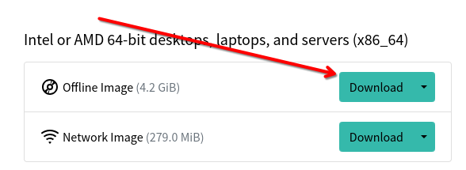

# Instalacja systemu

Przejdziemy razem przez instalację systemu openSUSE tumbleweed. Pobierzemy iso, nagramy je na pendrive i przejdziemy przez instalator systemu (Yast)

### Pobieranie obrazu systemu

Aby pobrać obraz systemu (.iso) openSUSE Tumbleweed udajemy się na [oficjalną stronę](https://https://get.opensuse.org/tumbleweed/) dystrybucji. W zakładce Download wybieramy Offline Image dla naszej architektury procesora. Jeżeli nie wiesz jaką architekturę ma twój procesor to najprawdopodobniej jest to x86_64, czyli pierwsza opcja.

Istnieje również możliwość pobrania dużo mniejszego obrazu sieciowego (Network Image) ale jeżeli korzystasz z WiFi i nie czujesz się komfortowo korzystając z TUI (Interfejsu terminala) to odradzam tę opcję.

### Nagrywanie obrazu na pendrive

Kiedy plik .iso się pobierze, będziemy musieli nagrać go na pendrive'a. W tym celu skorzystamy z programu Balena Etcher dostępnego na Windowsa/Maca/Linuksa. Możesz pobrać go [tutaj](https://etcher.balena.io/).

Etcher jest bardzo prosty w użytku.

1. Klikamy "Flash from file" i wybieramy plik .iso który pobraliśmy ze strony openSUSE.
2. Podłączamy do komputera pendrive'a i wybieramy go z listy po kliknięciu "Select target" **Uwaga, wszystkie dane z wybranego pendrive'a zostaną usunięte!**
3. Klikamy "Flash!". Cały proces może potrwać od kilku do kilkunastu minut. W tym czasie można zrobić sobie kawę ☕

### Uruchamianie instalatora

Gdy proces tworzenia pendrive zakończył się powodzeniem, uruchamiamy komputer ponownie i wchodzimy do Bios'u. Aby system działał poprawnie musimy znaleźć i upewnić się, że opcja "Secure Boot" jest **wyłączona** . Gdy wszystko się już zgadza, uruchamiamy komputer jeszcze raz i wchodzimy w tzw. Menedżer rozruchu (Boot Menu). Podczas uruchamiania się komputera należy kliknąć specjalny klawisz, zazwyczaj jest on wypisany na ekranie podczas startu - Jeżeli nie, to najlepiej wyszukać taką informację w internecie. Poniżej tabelka z możliwymi klawiszami u poszczególnych producentów.

| Producent | Boot Menu   | BIOS         |
| ----------- | ------------- | -------------- |
| Dell      | F12         | F2           |
| Lenovo    | F12, Fn+F11 | F1, F2       |
| HP        | Esc, F9     | F1, F10, Esc |
| Asus      | F8, Esc     | F9, Del      |
| Huawei    | F12         | F2, Del      |

 Naszym oczom powinno ukazać się menu. Szukamy w nim naszego pendrive'a i zatwierdzamy enterem. Teraz pokaże się grub, jest to menu które pozwala wybrać opcję uruchamiania. Wybieramy pierwszą opcję. Jeżeli wszystko wykonaliśmy poprawnie, to w tym momencie naszym oczom powinien ukazać się instalator.
