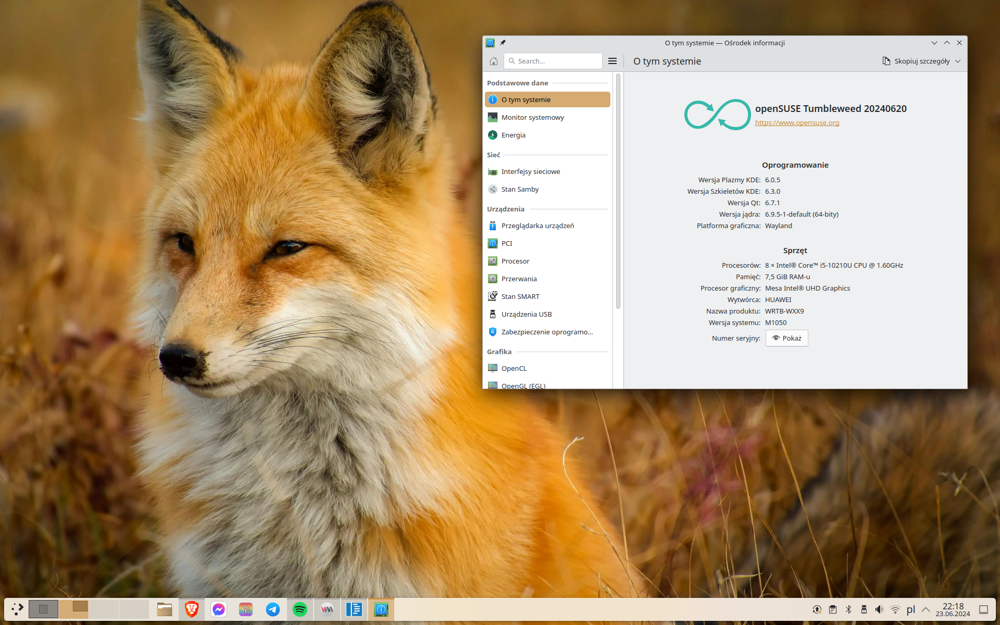

##### Wstęp. Dlaczego openSUSE tumbleweed?

Dlaczego warto wybrać openSUSE tumbleweed? Aby odpowiedzieć sobie na to pytanie
warto zastanowić się najpierw jaki powinien być idealny system operacyjny.

A powinien:

- być stabilny
- być aktualny
- być wydajny
- być łatwo dostępny
- posiadać szeroki zakres oprogramowania
- być godnym zaufania.

W jaki sposób openSUSE wpasowuje się w te wymagania?

##### Stabilność:

OpenSUSE posiada dwie wielkie zalety, które wpływają na jego stabilność. Są to
zautomatyzowane testy openQA oraz obsługa migawek systemu plików, tzw.
snapshotów. Zanim dotrze do nas aktualizacja systemu, musi ona przejść
automatyczne testy. W ten sposób poważne bugi są szybko wychwytywane i nie są
dostarczane do użytkowników końcowych. Nawet jeżeli testy nie dadzą rady
wychwycić wszystkiego i aktualizacja spowoduje jakieś problemy w naszej
instalacji, zawsze możemy przywrócić poprzednią migawkę. Tzn. powrócić do stanu
systemu przed aktualizacją i kontynuować naszą pracę.

##### Aktualność i wydajność:

OpenSUSE Tumbleweed jest dystrybucją z aktualizacjami typu ciągłego. Znaczy to, że
oprogramowanie jest aktualizowane na bieżąco. Nowe funkcje, poprawki
bezpieczeństwa i inne zmiany są wdrażane natychmiast po ich przetestowaniu i
uznaniu za stabilne. Znaczy to, że mamy doczynienia z aktualnym i najlepszym
dostępnym oprogramowaniem. Mamy wszystkie najnowsze funkcje i poprawki dla
wydajności. (pkt 3 moich wymagań). Dystrybucje ciągłe są z reguły uznawane za
mniej stabilne, jednak openSUSE jako jedna z niewielu dystrybucji posiada
openQA i obsługę snapshotów dzięki czemu jest wyjątkowo bezpieczną opcją.

##### Dostępność

Tu krótko. Tumbleweed jest dostępny na wiele platform. Obsługuje procesory
64bit i 32 bit co jest już rzadkością wśród dystrybucji Linuxa. Wspiera również
aarch64, ppc64le, s390x i ppc64. Więc będzie działać na praktycznie wszystkim.

##### Oprogramowanie

Do naszej dyspozycji są obszerne repozytoria openSUSE, Flatpak oraz repozytoria
społeczności OBS. Nic nie stoi również na przeszkodzie aby doinstalować obsługę
snap'a, choć nie jest to specjalnie zalecane.

Dzięki tym wszystkim źródłom oprogramowania najprawdopodobniej nigdy nie
znajdziesz się w sytuacji, że jakiejś paczki będzie ci brakować. A nawet jeżeli
\- w repozytorium znajduje się distrobox dzięki któremu można instalować
oprogramowanie z innych dystrybucji.

##### Zafuanie

Projekt openSUSE jest silnie związany z firmą SUSE, jednym z liderów w branży
Enterprise Linux. OpenSUSE Tumbleweed dostarcza kod, który SUSE wzmacnia i
dopracowuje, aby później stał się SUSE Linux Enterprise (SLE) – komercyjną
dystrybucją o bardzo dobrej reputacji. Dzięki temu mamy pewność, że serwery
openSUSE nie znikną z dnia na dzień i że projekt nie upadnie, jak to się często
dzieje z mniejszymi dystrybucjami.

#### Parę słów o poradniku.

Jak będzie wyglądać ten poradnik? Przede wszystkim wszystkie informacje
spróbuję podać w jak najbardziej przystępnej formie. Wiem, że wielu nowych
użytkowników Linuksa "choruje na terminalooporność". Dlatego postaram się
wszystko opisać tak, aby terminal nie był nam w ogóle potrzebny. Wszystko co
tutaj zaprezentuje będzie opisane w dwa sposoby - sposób graficzny i za pomocą
linii komend.

openSUSE jest dostępny w różnych wersjach. M.in Leap, Tumbleweed, Aeon, MicroOS. My będziemy korzystać z Tumbleweed jako, że na ten moment jest to najlepszy wybór do użytku codziennego.

Skupimy się również na środowisku graficznym KDE Plasma. OpenSUSE pozwala zainstalować również inne pulpity jednakże moim zdaniem to właśnie Plasma jest najlepiej rozwiniętym środowiskiem oraz jest bardzo dobrze wspierana w openSUSE.

Jeżeli chcesz pomóc w rozwoju poradnika możesz zaproponować swoje zmiany
poprzez Pull Request na Githubie

Mój pulpit :)
